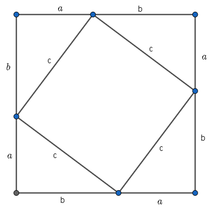
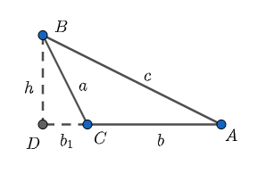
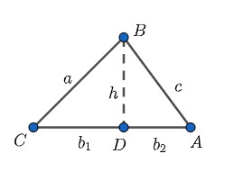
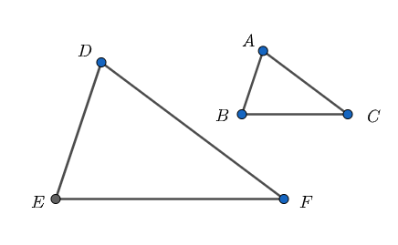
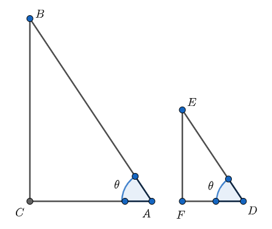
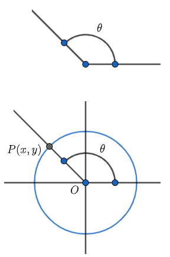
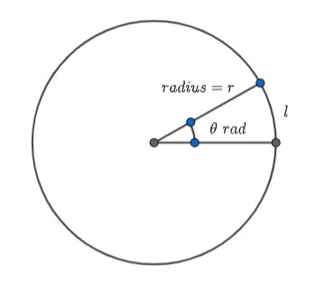
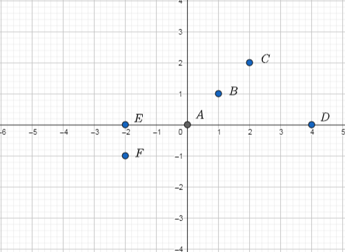
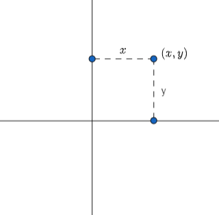

--- 
title: "The joy of elementary maths"
author: "Lingyun Zhang"
date: "`r Sys.Date()`"
site: bookdown::bookdown_site
output: bookdown::gitbook
documentclass: book
link-citations: yes
links-as-notes: true
colorlinks: true
---

```{r setup, include=FALSE}
knitr::opts_chunk$set(echo = TRUE)
```

# Preface {-}

To be written.

# Fun Algebra

In my opinion, from **Algebra** we learn two things, namely, (i) how to set up equations, and (ii) how to solve equations. In school, they usually pay more attention to (ii), however, mastering (i)  is very important for real-life problem solving.

When we want to set up equations, we actually translate the statement in a word problem into **algebraic expressions**. The key idea here is to use the letter $x$ to replace the *unknown* (of course, if there are two unknowns, we will use the letters $x$ and $y$).

After the "Knowledge Base" section---which briefly introduces the Algebra points in high school maths---we use a number of examples to show the beauties in (i) and (ii).

## Knowledge Base

In what follows in this section, $x$ is always the *unknown* to be found; $a$, $b$ and $c$ are constants and $a\neq 0$ is assumed if this is necessary.

- The solution to 
$$
ax + b=0,
$$
is 
$$
x=-\frac{b}{a}.
$$

- The solution to
$$
ax^2 + bx + c = 0,
$$
is 
$$
x = \frac{-b \pm \sqrt{b^2-4ac}}{2a},\ \hbox{provided}\ b^2-4ac \ge 0.
$$
NB: This is the so-called **quadratic formula**. To derive the formula, we need to use the "complete square method"; see this as an example in the next section. 

- The purpose for **factorization** is to find roots of an equation, or to simplify an algebraic expression.


- We can use the *method of elimination* to solve a system of linear equations. 


- The meaning of $x^\alpha$, where $x>0$ and $\alpha$ is an arbitrary real number. We need to distinguish the following cases.
    - **Case 1:** $\alpha=0$, then $x^\alpha=x^0=1$;
    - **Case 2:** $\alpha>0$
        - **sub-case 1:** $\alpha$ is an integer, then $x^\alpha=\underbrace{x\times x\times\cdots \times x}_{\text{repeat $\alpha$ times}}$;
        - **sub-case 2:** $\alpha=1/p$, where $p$ is a positive integer, then $x^\alpha$ is such a number $y$ that $y^p=x$;
        - **sub-case 3:** $\alpha=q/p$, where $p$ and $q$ are positive integers and they are co-prime, then $x^\alpha=x^{q/p}=\left(x^{1/p}\right)^q$;
        - **sub-case 4:** $\alpha$ is an irrational number, then we can find a rational number $q/p$ such that $|q/p-\alpha|<10^{-100}$, and $x^{q/p}$ can be regarded as $x^\alpha$;
    - **Case 3:** $\alpha<0$, then $x^\alpha=\frac{1}{x^{-\alpha}}$.
        
    


## Examples

### How much money can you save? {-}

Like me, if you take a bus and go to the downtown, you probably will see an ads in front of a shop, saying "Buy one and get the second for half price!" Here, a natural question to ask is: How much is the saving?

I guess you can solve the above problem in a way. However, trust me, the best way to solve the above problem is using **Algebra** as shown below.

**Solution.** Let the price of the item be $p$. So,
$$
\hbox{the saving} = 2p - (p + 0.5p) = 0.5p.
$$
The percentage saving is
$$
\frac{0.5p}{2p}=0.25=25\%.
$$


### Why is $0.99999...=1$ true? {-}

Our intuition tells us that
$$
0.\dot{9}\le 1.
$$
Here I will use **Algebra** to show that actually
$$
0.\dot{9}= 1.
$$

**Proof.** Let 
$$
x = 0.\dot{9}.
$$
Then,
$$
\begin{array}{ccl}
10x &=& 10\times 0.\dot{9}\\
&=& 10(0.9 + 0.09 + 0.009 + 0.0009 + \cdots)\\
&=& 9 + 0.9 + 0.09 + 0.009 + \cdots\\
&=& 9 + x,
\end{array}
$$
from which it follows that
$$
9x = 9.
$$
So, $x=9/9=1.$ The proof is completed.

**Exercises:**

  (a) Convert $0.\dot{1}$ to a fraction.
  (b) Covert $2.1\dot{2}\dot{3}$ to a fraction.

### The quadratic formula {-}

A general quadratic equation is given by
$$
ax^2+bx+c=0,
$$
where $a\neq 0$. Below is how to derive a formula to solve the equation. The method is called *complete square*.

**Derivation of the quadratic formula.**
$$
\begin{array}{cl}
&ax^2+bx+c=0\\
\Rightarrow & x^2+\frac{b}{a}x+\frac{c}{a}=0 \ \ [\hbox{divided by}\ a\ \hbox{on both sides}]\\
\Rightarrow & x^2 + 2\frac{b}{2a}x + \left(\frac{b}{2a}\right)^2+\frac{c}{a}=\left(\frac{b}{2a}\right)^2\ \ [\hbox{key step!}]\\
\Rightarrow & \left(x+\frac{b}{2a}\right)^2=\frac{b^2-4ac}{4a^2}\\
\Rightarrow & x+\frac{b}{2a}=\pm \frac{\sqrt{b^2-4ac}}{2a}\ \ [\hbox{provided}\ b^2-4ac\ge 0]\\
\Rightarrow & x = \frac{-b\pm \sqrt{b^2-4ac}}{2a}.
\end{array}
$$

### Find a continued fraction {-}

What is the following number
$$
2 + \frac{1}{2+\frac{1}{2+\frac{1}{2+\frac{1}{2+\cdots}}}}?
$$
This is an interesting problem. I only know one way to solve it---using Algebra.

**Solution.** Let $x$ be the number. We have
\begin{equation}
2 + \frac{1}{x} = x, (\#eq:c-fr-eq)
\end{equation}
Solving \@ref(eq:c-fr-eq), we get
$$
x = 1 + \sqrt{2}\ \hbox{or}\ x = 1 - \sqrt{2}.
$$
Since $x$ must be positive, we only keep $x=1+\sqrt{2}$.

### Chickens and rabbits problem {-}

Chickens and rabbits are kept in the same cage. Someone has done the counting and provided the information: there are 66 heads and 216 feet in the cage. How many chickens and rabbits, respectively, are there in the cage?

**Solution.** The two unknowns are $C$ and $R$, which are the number of chickens and the number of rabbits in the cage, respectively. Noting that each chicken has two feet and each rabbit has four feet, we can translate the information provided in the problem into the following equations:
$$
\begin{array}{ccl}
C+R &=&66 \\ 
2C+4R &=& 216 
\end{array}
$$
We use the *method of elimination* to solve the above two equations. To "knock out" the unknown $C$, we subtract  'two times the first equation' from the second equation and we have
$$
2R=84,
$$
from which we get
$$
R=42
$$
Next, we can easily find $C=24$. The final answer: $C=24$ and $R=42$.


# Beautiful Geomtry

## Plane Geometry

### Sum of inner angles of a triangle {-}

We all know that the sum of the three inner angles of a triangle is equal to $180^{\circ}$, but why is this true? Below a simple proof answers the question.

**Proof.** Observing the Figure \@ref(fig:trifig) below, we have
$$
\theta_1 + \theta_2 + \theta_3 = 360^{\circ},
$$
and
$$
(\theta_1 + \angle C) + (\theta_2 + \angle A) + (\theta_3 + \angle B) = 540^{\circ}.
$$
Thus, it follows from the above two equations that
$$
\angle A + \angle B + \angle C = 540^{\circ} - 360^{\circ}=180^{\circ}.
$$
The proof is completed.
```{r, trifig, echo=FALSE, fig.align = 'center', fig.cap="A triangle."}
knitr::include_graphics("figures/triangl.png")
```


**Exercise:** Suppose that we set a complete turn is $100^{\circ}$ but not $360^{\circ}$ any more. Then, what is the sum of the inner angles of a triangle?


### The Pythagorean Theorem (TPT) {-}

**TPT:** For any a right triangle, let $c$ be the length of the hypotenuse (the longest side), let $a$ and $b$ be the lengths of the other two sides. It's true that
$$
a^2+b^2=c^2.
$$

**Remark:** The book, *The Pythagorean Theorem*, written by Eli Maor, is all about the Theorem. According to this book, there are about 400 known proofs of the theorem. Below is an elegant proof and I like it the best.

**Proof of TPT:** The key is to construct the following diagram
```{r, py-fig, echo=FALSE, fig.align = 'center', fig.cap="Key diagram."}

```
So, we have the following equality: The area of the "big square" is the same as the area of the "four right triangles" plus the area of the "small square". That is,
$$
(a+b)^2 = 4(1/2)ab + c^2,
$$
which implies 
\begin{equation}
a^2+b^2+2ab=2ab + c^2 (\#eq:pytha-eq)
\end{equation}
Cancelling  the term $2ab$ from the both sides of \@ref(eq:pytha-eq), we get
$$
a^2+b^2=c^2.
$$

### The law of cosines {-}

For any a triangle $ABC$, it is true that
\begin{equation}
c^2= a^2 + b^2 - 2ab\cos C, (\#eq:cosine-eq)
\end{equation}
where $a$, $b$ and $c$ are the lengths of the sides that opposite to angles $A$, $B$ and $C$, respectively.

**Proof:** We distinguish three cases.

**Case 1:** $C=90^{\circ}$. In this case, the right hand side of Equation \@ref(eq:cosine-eq) is
$$
a^2 + b^2
$$
which equals $c^2$---the left hand side---according to The Pythagorean Theorem (TPT).

**Case 2:** $C>90^{\circ}$. In this case, we use Figure \@ref(fig:cosines-fig), and we have
$$
\begin{array}{lcl}
c^2& =& h^2 + (b_1 + b)^2\ \ \ [\hbox{according to TPT}]\\
&=&a^2 - b_1^2 + b_1^2 +2b_1b +b^2\ \ \ [\hbox{using TPT again}]\\
&=&a^2 + b^2 + 2b_1b\\
&=&a^2 + b^2 + 2a\cos(\angle BCD)b\\
&=&a^2 + b^2 + 2a\cos(180^{\circ} - C)b\\
&=&a^2 + b^2 - 2ab\cos C
\end{array}
$$
```{r, cosines-fig, echo=FALSE, fig.align = 'center', fig.cap="Figure for Case 2."}

```


**Case 3:** $C<90^{\circ}$. In this case, we use Figure \@ref(fig:cosines-case3-fig), and we have
$$
\begin{array}{lcl}
c^2&=& h^2 + b_2^2\ \ \ [\hbox{according to TPT}]\\
&=&a^2-b_1^2 + b_2^2\ \ \ [\hbox{using TPT again}]\\
&=&a^2 + (b_1 +b_2)^2 - 2b_1b_2 - 2b_1^2\\
&=&a^2 + b^2 - 2b_1(b_2+b_1)\\
&=&a^2 + b^2 - 2b_1b\\
&=&a^2 + b^2 - 2ab\cos C
\end{array}
$$


```{r, cosines-case3-fig, echo=FALSE, fig.align = 'center', fig.cap="Figure for Case 3."}

```

### The law of sines {-}

For any a triangle $ABC$, it is true that
\begin{equation}
\frac{a}{\sin A} = \frac{b}{\sin B}=\frac{c}{\sin C}=\frac{abc}{2T} (\#eq:sines-eq)
\end{equation}
where $a$, $b$ and $c$ are the lengths of the sides that opposite to angles $A$, $B$ and $C$, respectively; $T$ is the area of the triangle.

**Proof:** This is easy if we have noticed that
$$
T = \frac{1}{2}ab\sin C=\frac{1}{2} ac \sin B = \frac{1}{2} bc \sin A.
$$

### Heron's formula {-}

For any a triangle $ABC$ it is true that
\begin{equation}
T = \sqrt{s(s-a)(s-b)(s-c)}, (\#eq:heron-eq)
\end{equation}
where $T$ is the area, $a$, $b$ and $c$ are the lengths of the three sides (opposite to angles $A$, $B$ and $C$, respectively), $s=(a+b+c)/2$.

**Proof:** Let $RHS$ be the Right-Hand-Side of Equation \@ref(eq:heron-eq).
$$
\begin{array}{lcl}
RHS &=& \frac{1}{4}\sqrt{(a+b+c)(b+c-a)(a+c-b)(a+b-c)}\\
&=& \frac{1}{4}\sqrt{[(b+c)^2-a^2][a^2-(c-b)^2]}\\
&=& \frac{1}{4}\sqrt{(2bc+2bc\cos A)(2bc-2bc\cos A)}\ \ \ [\hbox{according to the law of cosines}]\\
&=&\frac{1}{2}bc\sqrt{1-\cos^2A}\\
&=&\frac{1}{2}bc\sin A\\
&=&T
\end{array}
$$

### Similarity between two triangles {-}

For any two triangles, say $ABC$ and $DEF$, if
$$
\angle A = \angle D, \ \angle B = \angle E,\ \hbox{and}\ \angle C = \angle F,
$$
then 
$$
\frac{AB}{DE}=\frac{BC}{EF}=\frac{CA}{FD}.
$$
(It's said that the two angles are **similar**. See Figure \@ref(fig:similar-fig))

**Proof:** Using the law of sines twice, we have
$$
\frac{AB}{\sin C}=\frac{BC}{\sin A},
$$
and
$$
\frac{DE}{\sin F}=\frac{EF}{\sin D}.
$$
Next, doing "division", we have
\begin{equation}
\frac{\frac{AB}{\sin C}}{\frac{DE}{\sin F}}=\frac{\frac{BC}{\sin A}}{\frac{EF}{\sin D}}. (\#eq:similar-ratio)
\end{equation}
Since
$$
\angle C = \angle F\ \hbox{and}\ \angle A=\angle D,
$$
Equation \@ref(eq:similar-ratio) can be simplified as
$$
\frac{AB}{DE}=\frac{BC}{EF}.
$$
In a similar manner, we can show that
$$
\frac{AB}{DE}=\frac{CA}{FD},
$$
and the proof is completed.


```{r, similar-fig, echo=FALSE, fig.align = 'center', fig.cap="Two similar triangles"}

```

## Coordiante Geometry

# Tricky Trigonometrics

## Basic Facts About Right Triangles

- **(F1)** There are infinite right triangles.

- **(F2)** Let $ABC$ be a right triangle and $\angle C=90^\circ$. It is true that
$$
\angle A + \angle B = 90^\circ.
$$
That is to say, once we know a non-right angle (e.g. the smallest angle) in the right triangle, we then know all the three angles. To put this in another way: When we study a right triangle in terms of angles, we only need to pay attention to one of its non-right angle.

- **(F3)** For any two right triangles, $ABC$ and $DEF$, they are similar if and only if one non-right angle in $ABC$ is equal to an angle in $DEF$.

## The Six Ratios

Take two right triangles $ABC$ and $DEF$ such that
$$
\angle C= \angle F = 90^\circ\ \hbox{and}\ \angle A =\angle D = \theta,
$$
where $0^\circ < \theta < 90^\circ$ and $\theta$ is fixed (e.g. $\theta = 30^\circ$).

```{r, two-right-triangles-fig, echo=FALSE, fig.align = 'center', fig.cap="Two similar right triangles"}

```

According to **(F3)**, we know that $ABC$ and $DEF$ are similar. Thus, we have
$$
\frac{BC}{EF}=\frac{AB}{DE}\Rightarrow \left\{
\begin{array}{ccc}
\frac{BC}{AB}&=&\frac{EF}{DE},\\
\frac{AB}{BC}&=&\frac{DE}{EF};
\end{array}
\right.
$$
$$
\frac{AC}{DF}=\frac{AB}{DE}\Rightarrow \left\{
\begin{array}{ccc}
\frac{AC}{AB}&=&\frac{DF}{DE},\\
\frac{AB}{AC}&=&\frac{DE}{DF};
\end{array}
\right.
$$
$$
\frac{AC}{DF}=\frac{BC}{EF}\Rightarrow \left\{
\begin{array}{ccc}
\frac{AC}{BC}&=&\frac{DF}{EF},\\
\frac{BC}{AC}&=&\frac{EF}{DF}.
\end{array}
\right.
$$

Based on the above, we can draw the conclusion:
The six ratios, $\frac{BC}{AB}$, $\frac{AB}{BC}$, $\frac{AC}{AB}$, $\frac{AB}{AC}$, $\frac{BC}{AC}$ and $\frac{AC}{BC}$ are determined by $\theta$. At this point, for any $0^\circ < \theta < 90^\circ$, we can make the following **definitions**:
$$
\begin{array}{c}
\sin \theta = \frac{BC}{AB},\ \ \csc \theta = \frac{AB}{BC}=\frac{1}{\sin \theta}\\
\cos \theta = \frac{AC}{AB}.\ \ \sec \theta = \frac{AB}{AC}=\frac{1}{\cos \theta}\\
\tan \theta = \frac{BC}{AC},\ \ \cot \theta = \frac{AC}{BC}=\frac{1}{\tan \theta},
\end{array}
$$

## Extension

So, for any $0^\circ < \theta < 90^\circ$, we can define $\sin \theta$ (its reciprocal $\csc \theta$), $\cos \theta$ (its reciprocal $\sec \theta$), and $\tan \theta$ (its reciprocal $\cot \theta$). Next, we extend the domain of $\theta$ outside $(0^\circ, 90^\circ)$, and we also allow $\theta$ to be negative. The key is to use **circles** and **coordinates**.

```{r, trig-func-extension-fig, echo=FALSE, fig.align = 'center', fig.cap="Illustration"}

```

For any $0^\circ \le \theta \le 360^\circ$, we draw $OP$ such that i) point $P$ is on the circle and ii) the angle from the $x$-axis to $OP$ (**anticlockwise**) is $\theta$ (see the Figure \@ref(fig:trig-func-extension-fig).) Then, we define
$$
\begin{array}{ccl}
\sin \theta &=&\frac{y}{\sqrt{x^2+y^2}}\\
\cos \theta &=&\frac{x}{\sqrt{x^2+y^2}}\\
\tan \theta &=& \frac{y}{x}\ \ (\hbox{provided}\ x\neq 0)
\end{array}
$$

If point $Q$ is on the circle and the angle from the $x$-axis to $OQ$ (**clockwise**) is $-\theta$, then the coordinates of point $Q$ must be $(x, -y)$. Therefore, we have
$$
\begin{array}{ccl}
\sin(-\theta) &=& \frac{-y}{\sqrt{x^2 +(-y)^2}} = -\frac{y}{\sqrt{x^2 +y^2}}=-\sin\theta\\
\cos(-\theta) &=& \frac{x}{\sqrt{x^2 +(-y)^2}} = \frac{x}{\sqrt{x^2 +y^2}}=\cos\theta\\
\tan(-\theta) &=& \frac{-y}{x} = -\frac{y}{x}=-\tan\theta\\
\end{array}
$$

Based on the above definition, we derive the following equations: For $k=0,\ \pm 1,\ \pm 2, \ldots$
$$
\begin{array}{ccl}
\sin(k\cdot 360^\circ +\theta) &=& \sin\theta,\\
\cos(k\cdot 360^\circ +\theta) &=& \cos\theta,\\
\tan(k\cdot 360^\circ +\theta) &=& \tan\theta,\\
\end{array}
$$
since $k\cdot 360^\circ+\theta$ and $\theta$ correspond to the same point on the circle.

## Radians

For any a given circle, let $C$ and $r$ denote the circumference and radius, respectively. It has been **discovered** that 
$$
\frac{C}{r}=2\pi.
$$
Thus,
$$
\begin{array}{ccl}
\frac{C/2}{r} &=& \pi,\\
\frac{C/4}{r} &=& \frac{\pi}{2},\\
\frac{C/8}{r} &=& \frac{\pi}{4}.
\end{array}
$$
Long long time ago, it was **decided** that

- full circle (or a complete turn) corresponds to $360^\circ$,
- half circle corresponds to $180^\circ$,
- a quarter circle corresponds to $90^\circ$.

So, we have the 1-to-1 correspondence
$$
\begin{array}{ccl}
360^\circ &\longleftrightarrow& 2\pi\\
180^\circ &\longleftrightarrow& 1/2 \cdot 2\pi=\pi\\
90^\circ &\longleftrightarrow& 1/4 \cdot 2\pi=\pi/2\\
&\cdots&
\end{array}
$$
Based on the above, for any $0^\circ\le \alpha\le 360^\circ$, we know that
$$
\alpha^\circ \longleftrightarrow \frac{\alpha}{360}\cdot 2\pi.
$$
The point here is that for any an angle it can be associated with two numbers, namely $\alpha^\circ$ and $\frac{\alpha}{360}\cdot 2\pi\ \hbox{radians}$. Thus, we establish the following equation
$$
\alpha^\circ = \frac{\alpha}{360}\cdot 2\pi\ \hbox{radians}
$$
**Remark:** For simplicity reason, we often use "rad" rather than "radian".

**Summary points:**

- For any an angle, we can either use **degrees** or **radians** to measure it. For example
$$
\begin{array}{c}
\angle A = 60^\circ = \frac{60}{360}\cdot 2\pi\ \hbox{rad}=\frac{\pi}{3}\ \hbox{rad}\\
\angle B = 150^\circ = \frac{150}{360}\cdot 2\pi\ \hbox{rad}=\frac{5\pi}{6}\ \hbox{rad}\\
\angle C = 1\ \hbox{rad}=\frac{1}{2\pi}\cdot 360^\circ\approx 57,3^\circ\\
\angle D = 2.5\ \hbox{rad}=\frac{2.5}{2\pi}\cdot 360^\circ\approx 143.2^\circ
\end{array}
$$

- It can be shown that the length of circular arc (see Figure \@ref(fig:radian-fig)) is
$$
l = r\theta.
$$
(Proof: Since $\frac{l}{C}=\frac{\theta}{2\pi}$, $\frac{l}{\theta}=\frac{C}{2\pi}=r$, which implies that $l=r\theta.$)

```{r, radian-fig, echo=FALSE, fig.align = 'center', fig.cap="Illustration"}

```

# Complex Numbers

**Acknowledgement:** When I wrote this chapter, I was inspired by Chapter 5 "Portent of the ideal world"" of *In Pursuit of the Unknown---17 Equations That Changed the World* written by Ian Stewart.

## What are complex numbers

*Complex numbers* are the numbers in the 2-dimension space, i.e. the *plane*, and in  contrast *real numbers* are the numbers in the 1-dimension space, i.e. the *number line*. We can use **two** real numbers to express a complex number. For example, $(0, 0)$, $(1, 1)$, $(2, 2)$, $(4, 0)$, $(-2, 0)$, $(-2, -1)$, these six complex numbers correspond to the six points shown in Figure \@ref(fig:complex-number-fig1).


```{r, complex-number-fig1, echo=FALSE, fig.align = 'center', fig.cap="Six points"}

```

Figure \@ref(fig:complex-number-fig2)  shows the general idea of any a complex number $(x, y)$.

```{r, complex-number-fig2, echo=FALSE, fig.align = 'center', fig.cap="General idea about a complex number"}

```

After understanding what complex numbers are, immediately we can find the following facts:

- All the real numbers are complex numbers, or in other words, $R$ (the set of all the real numbers) is a subset of $C$ (the set of all the complex numbers).
- For any two complex numbers, say $z_1=(x_1, y_1)$ and $z_2=(x_2, y_2)$, if any of them is not real, then we cannot compare them, i.e. we just cannot know if $z_1<z_2$ or $z_1>z_2$.

## How to make use of complex numbers

Here we talk about the $+$ (addition), $-$ (subtraction), $\times$ (multiplication) 
and $\div$ (division) operations between two complex numbers.

Given any two complex numbers, $z_1=(x_1, y_1)$ and $z_2=(x_2, y_2)$:

- $z_1+z_2=(x_1, y_1)+(x_2, y_2)=(x_1+x_2, y_1+y_2)$;

- $z_1-z_2=(x_1, y_1)-(x_2, y_2)=(x_1-x_2, y_1-y_2)$;

- $z_1\times z_2=(x_1, y_1)\times (x_2, y_2)=(x_1x_2-y_1y_2, x_1y_2+x_2y_1)$;

- $\frac{z_1}{z_2}=\frac{(x_1, y_1)}{(x_2, y_2)}=\frac{(x_1, y_1)\times (x_2, -y_2)}{(x_2, y_2)\times (x_2, -y_2)}=\left(\frac{1}{x_2^2+y_2^2}, 0\right)\left[(x_1, y_1)\times (x_2, -y_2)\right]$

## Why complex numbers

The equation $x^2+1=0$ has no solution. However, if we translate this equation into 2-D, we have 
$$
z^2 + (1, 0) = (0, 0),
$$
and it has solutions as $z=(0, 1)$ or $z=(0, -1)$. This is an obvious reason that we need complex numbers. Actually, it turns out complex numbers are so useful in studying waves (e.g. sound, light and electricity). If you study maths at a university, it is very likely you will learn Fourier analysis, where complex numbers are the fundamental building blocks.

## Back to the convention


# Other Stuff

## Interesting Number Series

### Three integer sequences

We consider the following three integer sequences

**Sequence 1:** $1, 2, 3, \ldots, n, \ldots,$

**Sequence 2:** $1^2, 2^2, 3^2, \ldots, n^2, \ldots,$

**Sequence 3:** $1^3, 2^3, 3^3, \ldots, n^3, \ldots,$

Let $S_n^{(k)}$ be the sum of the first $n$ terms of the $k$th sequence in the above. Then,
\begin{align}
S_n^{(1)}&=\frac{n(n+1)}{2}, (\#eq:sn1)\\
S_n^{(2)}&=\frac{n(n+1)(2n+1)}{6}, (\#eq:sn2)\\
S_n^{(3)}&= \left(S_n^{(1)}\right)^2. (\#eq:sn3)\\
\end{align}

**Proof of \@ref(eq:sn1)**. We have
$$2S_n^{(1)}=[1+2+\cdots+(n-1)+n] +[n+(n-1)+\cdots+2+1]=n(n+1).$$ 
Thus,
$$S_n^{(1)}=\frac{n(n+1)}{2}.$$

**Proof of \@ref(eq:sn2)**. We use mathematical induction method.
$$
S_1^{(2)}=1^2=\frac{1\times (1+1)\times (2\times 1+1)}{6},
$$
so, \@ref(eq:sn2) holds when $n=1$. Suppose that \@ref(eq:sn2) holds when $n=m$, where $m\ge 1$, and now we show that \@ref(eq:sn2) holds when $n=m+1$. We have
\begin{align}
S_{m+1}^{(2)}&=S_m^{(2)} + (m+1)^2\notag\\
&=\frac{m(m+1)(2m+1)}{6} + (m+1)^2\notag\\
&=\frac{(m+1)[m(2m+1)+6(m+1)]}{6}\notag\\
&=\frac{(m+1)(2m^2+7m+6)}{6}\notag\\
&=\frac{(m+1)(m+2)(2m+3)}{6},\notag
\end{align}
which completes the proof.

**Proof of \@ref(eq:sn3)**. We leave this proof for readers.

### Arithmetic sequences

### Geometric sequences


## Serious Inequlities

### Average is Between the Min and Max

Let $x_1,\ x_2,\ \ldots,\ x_n$ be $n$ numbers. Let $w_1,\ w_2,\ \ldots,\ w_n$ be $n$ positive numbers such that $\sum_{i=1}^n w_i = 1$ (i.e. $w_i$ for $i=1, \ldots, n$ are the so-called weights, and a special case is $w_1=w_2=\ldots=w_n=1/n$). Let the minimum be
$$
m:=\hbox{min}\{x_1, x_2, \ldots, x_n\};
$$
let the maximum be
$$
M:=\hbox{max}\{x_1, x_2, \ldots, x_n\},
$$
The following are true.

  (a) $m \le x_i \le M$, for $i=1, 2, \ldots, n.$
  (b) $m\le \sum_{i=1}^n w_i x_i \le M.$
    
Statement a is obvious; now we show b is true.

**Proof of b.** Since
$$
m \le x_i, \ \hbox{for}\ i=1, 2, \ldots,  n,
$$
$$
mw_i \le w_ix_i, \ \hbox{for}\ i=1, 2, \ldots,  n.
$$
Thus,
$$
m=\sum_{i=1}^n mw_i\le \sum_{i=1}^n w_ix_i.
$$
In the same manner, we can prove
$$
\sum_{i=1}^n w_ix_i \le M.
$$

**Exercise** (kind of challenging). Let $x_1, x_2, \ldots, x_n$ be $n$ arbitrary positive numbers; let $y_1, y_2, \ldots, y_n$ be another $n$ arbitrary positive numbers. Show that
$$
\hbox{min}\{x_1/y_1, x_2/y_2, \ldots, x_n/y_n\}\le \frac{\sum_{i=1}^n x_i}{\sum_{i=1}^n y_i} \le \hbox{max}\{x_1/y_1, x_2/y_2, \ldots, x_n/y_n\}.
$$

### Cauchy-Schwarz inequality

Let $\{a_1, \ldots, a_n\}$ and $\{b_1, \ldots, b_n\}$ be two sets of arbitrary $n$ real numbers, where $n$ is a positive integer. Then
\begin{equation}
\left(\sum_{i=1}^n a_ib_i\right)^2\le \sum_{i=1}^n a_i^2\sum_{i=1}^n b_i^2. (\#eq:c-s)
\end{equation}

**Proof:** Let $\lambda$ be a symbol. It is always true that
$$
\sum_{i=1}^n(a_i\lambda - b_i)^2\ge 0,
$$
that is,
$$
\sum_{i=1}^n a_i^2\lambda^2-2\sum_{i=1}^n a_ib_i\lambda+\sum_{i=1}^n b_i^2\ge 0.
$$
If $\sum_{i=1}^n a_i^2=0$, then \@ref(eq:c-s) holds. Now, we assume $\sum_{i=1}^n a_i^2\neq 0$, Then, the discriminant
$$
\Delta=\left(-2\sum_{i=1}^n a_ib_i\right)^2-4\sum_{i=1}^n a_i^2\sum_{i=1}^n b_i^2\le 0,
$$
which implies that
$$
\left(\sum_{i=1}^n a_ib_i\right)^2\le \sum_{i=1}^n a_i^2\sum_{i=1}^n b_i^2,
$$
and the equality holds if and only if
$$
a_i\lambda-b_i=0,\ \text{for}\ i=1, \ldots, n,
$$
which in the language of *linear algebra* tells that the two vectors $(a_1, \ldots, a_n)$ and $(b_1, \ldots, b_n)$ are *linearly dependent*.


### Relations among four means

Let $x_1, x_2, \ldots, x_n$ be $n$ positive real numbers. We can define

- **arithmetic mean:** $\mu_A=\sum_{i=1}^n x_i/n$
- **harmonic mean:** $\mu_H=n/\sum_{i=1}^n x_i^{-1}$
- **geometric mean:** $\mu_G=\left(\prod_{i=1}^n x_i\right)^{1/n}$
- **square mean:** $\mu_S=\sqrt{\sum_{i=1}^n x_i^2/n}$

The following holds
$$
\mu_H\le \mu_G\le \mu_A \le \mu_S.
$$

**Proof of $\mu_G\le \mu_A$**. 
$$
\left(\prod_{i=1}^n x_i\right)^{1/n}\le \frac{\sum_{i=1}^n x_i}{n}\Leftrightarrow \frac{1}{n}\sum_{i=1}^n\ln x_i\le \ln\left(\frac{\sum_{i=1}^nx_i}{n}\right),
$$
which can be proved by using the fact that $y=-\ln x$ is a *convex* function, and the Jensen Inequality: If $f(x)$ is a convex function, then
$$
f\left(\sum_{i=1}^n \lambda_i x_i\right) \le \sum_{i=1}^n \lambda_i f(x_i),
$$
where $\sum_{i=1}^n \lambda_i=1$ and $\lambda_i>0$ for $i=1, \ldots, n.$

**Proof of $\mu_H\le \mu_G$**. 

Let 
$u_i=x_i^{-1},\ \text{for}\ i=1, \ldots, n.$ Then, $\mu_H\le \mu_G$ becomes
$$
\frac{n}{\sum_{i=1}^n u_i}\le \frac{1}{\left(\prod_{i=1}^n u_i\right)^{1/n}},
$$ 
which holds because as we just proved
$$
\left(\prod_{i=1}^n u_i\right)^{1/n}\le \frac{\sum_{i=1}^n u_i}{n}
$$

**Proof of $\mu_A\le \mu_S$**.

Taking square on both sides of $\mu_A\le \mu_S$, we have
$$
\left(\frac{\sum_{i=1}^n x_i}{n}\right)^2\le \frac{\sum_{i=1}^n x_i^2}{n},
$$
which can be simplified as
$$
\left(\sum_{i=1}^n x_i\right)^2 \le n\sum_{i=1}^n x_i^2.
$$
According to the Cauchy-Schwarz inequality, we have
$$
\left(\sum_{i=1}^n x_i\right)^2=\left(\sum_{i=1}^n x_i\cdot 1\right)^2\le \sum_{i=1}^n x_i^2\sum_{i=1}^n 1^2=n\sum_{i=1}^n x_i^2,
$$
which completes the proof.


## Hard Combinatorics


